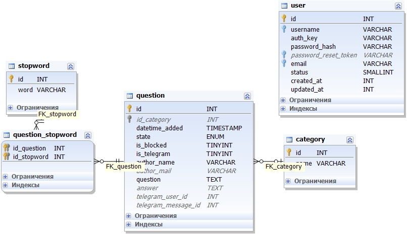

Netology Diploma Project
===============================

@author Ksenia Konovalova

# Установка
Для установки нужно скопировать все содержимое в корневой каталог вашего сервера. Для веб-сервера Nginx необходима дополнительная настройка:
```
https://github.com/yiisoft/yii2/blob/master/docs/guide/start-installation.md#recommended-nginx-configuration-
```

Домашняя директория:
```
/frontend/web/
```

Дефолтный пользователь:
```
admin:adminadmin
```

## БД
Параметры подключения к БД задаются в файле:
```
/common/config/main.php
```

Дамп базы данных:
```
faq.sql
```

Схема базы данных:
```
db_schema.jpg
```




# Дополнительный функционал

## Логгер

Класс:
```php
class common\log\AppTarget
```

Лог-файл:
```
/frontend/runtime/logs/actions.log
```

## Блокировка по ключевым словам

Класс:
```php
class frontend\models\Stopword
class frontend\models\StopwordsSearch
```

Метод:
```php
frontend\models\Question->save()
```

## Telegram Bot
Класс:
```php
class frontend\mods\Telegram
```

Бот:
```
http://telegram.me/FAQNetDiplomaBot
```